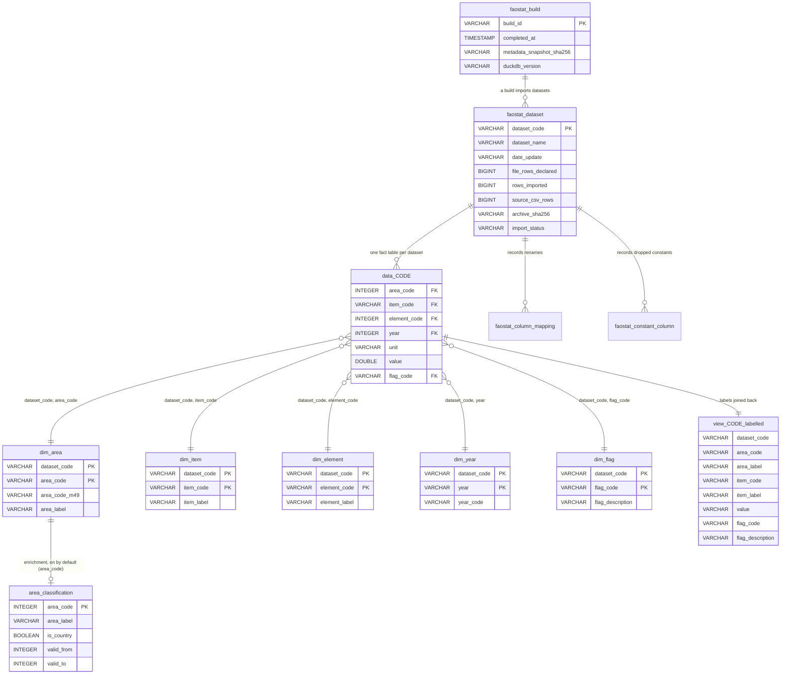

# FAOSTATdb

A local, **source-preserving DuckDB mirror of FAOSTAT bulk data**.

FAOSTATdb downloads FAOSTAT bulk ZIP archives, validates them, and imports each dataset into a single DuckDB file — one fact table per dataset (`data_<code>`), with repeated labels lifted into shared dimension tables. It is **not** a harmonization layer: flags are retained and values are never altered. It removes storage-level duplication and records reproducibility metadata (source hashes, timestamps, tool/duckdb/python versions) so a built database can be audited and cited.

**Design principle (the tie-breaker for every borderline decision):**

> FAOSTATdb preserves the statistical content of FAOSTAT exactly, while removing storage-level duplication and adding reproducibility metadata.

## Install

The only prerequisite you need to install yourself is Python >= 3.11. All Python package dependencies, including `duckdb`, are installed automatically by `pip`.

Choose one of these installation methods:

### With `python -m pip`

```bash
python3 -m pip install "git+https://github.com/clara-roch/faostatdb.git#egg=faostatdb[ui]"
```

### With `pipx`

```bash
pipx install "git+https://github.com/clara-roch/faostatdb.git#egg=faostatdb[ui]"
```

You do not need to install `duckdb` yourself. The optional `[ui]` extra only adds nicer progress output and better cache-directory defaults.

## Quick start

```bash
faostatdb list                              # what would a build download?
faostatdb build --include AE --yes          # build one tiny dataset (~77 KB)
faostatdb build --yes                       # build everything (asks first, unless --yes)
faostatdb info                              # summarize the built database
faostatdb sql "SELECT * FROM faostat_dataset LIMIT 5"
```

By default, downloaded archives are **deleted after a successful build** (`keep_archives = false`). Hot restart still saves you: archives are never deleted until the build *succeeds*, so an interrupted or partially-failed run reuses what it already fetched. If you're iterating (rebuilding repeatedly), set `keep_archives = true` to keep the `.zip` cache across successful builds too. See [Caching & re-runs](#caching--re-runs).

## Commands

`faostatdb` exposes the commands below. Run `faostatdb --help` (or `--version`) for the top-level summary, and `faostatdb <command> --help` for any one of them.

| Command                                     | What it does                                                                                                                                                                                                                                     |
| ------------------------------------------- | ------------------------------------------------------------------------------------------------------------------------------------------------------------------------------------------------------------------------------------------------ |
| `faostatdb list`                            | Fetches the FAOSTAT bulk inventory (`datasets_E.json`), applies your selection (`all` / `include` / `exclude`), and prints the selected dataset codes + names and a count of selected-of-available. Preview exactly what a build would download. |
| `faostatdb build`                           | The main command: selects datasets, downloads and validates archives, imports each into the DuckDB file, extracts dimensions + flags, builds labelled views, records provenance, and compacts the result. See the flags below.                   |
| `faostatdb tables`                          | Opens a built database read-only and lists every table with an estimated row count.                                                                                                                                                              |
| `faostatdb info`                            | Prints a **reproducibility summary** of a built database: size, dataset count, build timestamp, metadata SHA256, and tool/DuckDB/Python versions.                                                                                                |
| `faostatdb validate`                        | Opens a built database read-only and checks that every `data_<code>` fact table exists and is queryable (non-empty). Exits non-zero on problems.                                                                                                 |
| `faostatdb config show`                     | Prints the **effective** configuration as TOML (committed defaults after `secrets.env` env vars are merged).                                                                                                                                     |
| `faostatdb config init`                     | Writes a default `faostatdb.toml` into the current directory (`--force` to overwrite).                                                                                                                                                           |
| `faostatdb clean-cache`                     | Deletes cached archives (`*.zip`/`*.part`) and the download manifest from the download directory, and reports how much was freed.                                                                                                                |
| `faostatdb sql "<query>"`                   | Runs one SQL query against a built database (read-only) and prints an aligned text table — a convenience wrapper, no pandas required.                                                                                                            |
| `faostatdb self-contained -o faostatdb.pyz` | Bundles the package into a single executable `.pyz` (stdlib `zipapp`) you can drop in `~/.local/bin`. Run it with `python faostatdb.pyz build …`.                                                                                                |
| `faostatdb bench --include QCL,FBS`         | Measures **download throughput** at several `--jobs` levels (re-downloading the given datasets each time) so you can pick the best concurrency for your connection. Requires an explicit `--include`; never benchmarks the whole inventory.      |

### `faostatdb build`

```bash
faostatdb build [--database PATH] [--include QCL,FBS] [--exclude FA,CBH] \
                [--jobs N] [--keep-archives | --no-keep-archives] \
                [--download-dir DIR] [--yes] [--strict] \
                [--no-compact] [--keep-raw-tables] \
                [--no-enrich-areas] [--no-enrich-history] \
                [--json] [--ascii] [--no-progress]
```

| Flag                                       | Effect                                                                                                                                                                                                                                        |
| ------------------------------------------ | --------------------------------------------------------------------------------------------------------------------------------------------------------------------------------------------------------------------------------------------- |
| `--database PATH`                          | Output DuckDB path/filename (overrides `build.database`). A bare filename is written project-local (or under `$FAOSTATDB_DATABASE_DIR` if set); see [Where files are stored](#where-files-are-stored).                                        |
| `--include QCL,FBS`                        | Build **only** these codes (selection mode → `include`).                                                                                                                                                                                      |
| `--exclude FA,CBH`                         | Build everything **except** these codes (mode → `exclude`). `--include` wins if both are given.                                                                                                                                               |
| `--jobs N`                                 | Parallel download workers (overrides `build.jobs`; `0`/unset = auto `min(8, 2×cpu)`).                                                                                                                                                         |
| `--keep-archives` / `--no-keep-archives`   | Force keeping / deleting the cached `*.zip` after a successful build. Default: **delete** on success (`keep_archives = false`); hot restart still reuses them after a failure.                                                                |
| `--download-dir DIR`                       | Where raw archives are cached (overrides `build.download_dir`).                                                                                                                                                                               |
| `--yes` (alias `--all`)                    | Skip the confirmation prompt. **Required** for non-interactive runs (CI/scripts).                                                                                                                                                             |
| `--strict`                                 | Abort the whole build on the first error. Without it, failed datasets are recorded + skipped and the rest continue.                                                                                                                           |
| `--no-compact`                             | Skip the final compaction pass (faster, but a larger file — see [Making the database small](#making-the-database-as-small-as-possible)).                                                                                                      |
| `--keep-raw-tables`                        | Also keep an untouched `raw_<code>` copy of each import (debugging losslessness).                                                                                                                                                             |
| `--enrich-areas` / `--no-enrich-areas`     | Build (default) / skip the clearly-labelled `area_classification` table (curated `is_country` flag). **On by default**; still not source FAOSTAT content — see [How `area_classification` is computed](#how-area_classification-is-computed). |
| `--enrich-history` / `--no-enrich-history` | Fill (default) / skip `valid_from`/`valid_to` on `area_classification` for well-known former/successor areas (USSR, Sudan (former) → South Sudan, …) from the same curated CSV. Implies `--enrich-areas`. **On by default**.                  |
| `--json`                                   | Emit machine-readable JSON-lines progress on **stdout** (human logs stay on stderr). Great for CI.                                                                                                                                            |
| `--ascii`                                  | Use ASCII status icons (`[OK]`/`[X]`) instead of Unicode (`✓`/`✗`).                                                                                                                                                                           |
| `--no-progress`                            | Suppress animated progress bars (per-dataset event lines still print).                                                                                                                                                                        |

```bash
faostatdb build --yes                                      # full database
faostatdb build --include QCL,FBS --database food.duckdb   # a subset
faostatdb build --yes --json > build-events.jsonl          # CI-friendly log
```

#### Re-running only the missing / failed datasets

A build is **incremental and non-destructive** as long as `overwrite` stays `false` (the default). The build opens the existing `.duckdb` in place and only touches the tables for datasets it imports — each import does `DROP TABLE IF EXISTS data_<code>` for *that* code alone, then recreates it. Any `data_<code>` not in the current selection is left exactly as it was.

So if some datasets failed (a dropped download, a corrupt archive) while the rest imported fine, re-run with `--include` listing only the codes to redo:

```bash
faostatdb build --yes --include CBH,SXS,WCAD
```

Failed datasets keep their cached archives, so the re-run reuses them via the hot-restart manifest instead of downloading again.

> ⚠️ Do **not** set `overwrite = true` for this — it wipes the whole database file before building, losing the datasets you already have.

## Caching & re-runs

The slow, flaky part of a build is downloading \~70 archives from FAO's server. FAOSTATdb is built so you pay that cost **once**:

- Every download is tracked in a **manifest** (`.faostatdb-downloads/manifest.jsonl`) with an explicit state machine: `pending → downloading → downloaded → zip_valid|zip_invalid → importing → imported|failed`.
- Archives download to `*.part` and are **atomically renamed** to `*.zip` only on completion, so a killed process never leaves a half-file masquerading as valid.
- Within a run (and across interrupted/failed runs), any archive present on disk **and** recorded as `downloaded`/`imported` is **reused verbatim** — no re-download. (Phase 2 re-validates every archive with `zipfile.testzip()` anyway, so a corrupt reuse is caught and re-fetched.)
- `keep_archives` defaults to **false**, so archives are deleted once the build *succeeds* — but never before, so a crash/failure still leaves them for the next run. If you're iterating on the import/schema and want fast repeated builds, set `--keep-archives` (or `keep_archives = true`) to persist the cache across successful builds; use `faostatdb clean-cache` to wipe it on demand.

### Tuning download concurrency (`faostatdb bench`)

The one performance knob for downloads is `--jobs` (how many archives fetch in parallel). The best value depends on your connection and the FAO server, so rather than guess, measure it:

```bash
faostatdb bench --include QCL,FBS,RL --jobs-list 1,2,4,8 --yes
```

This downloads the listed datasets fresh at each concurrency level and prints a small table of wall-clock time and MB/s, flagging the fastest level with `*`:

```text
 jobs    wall_s      MB/s   files   fail
--------------------------------------------
    1     12.40      6.1        3      0
    2      6.80     11.1        3      0
    4      4.10     18.4        3      0 *
    8      4.30     17.6        3      0

fastest: 4 job(s) at 4.10s
```

Pick the winner as your `--jobs` (or `jobs` in config). `bench` **requires an explicit `--include`** — it re-downloads at every level, so it refuses to point at the whole inventory and hammer the server. It keeps no cache (the scratch archives are deleted afterwards).

## Database schema at a glance

The diagram below shows how the tables relate. `data_<code>` is one fact table per dataset (`data_qcl`, `data_fbs`, …); each `dim_<stem>` is shared across datasets and keyed by `(dataset_code, <stem>_code)` — except `dim_year`, keyed on the bare `year` that the fact table keeps; `view_<code>_labelled` is the join of a fact table to its dimensions. A rendered/standalone version lives in [`docs/schema.qmd`](docs/schema.qmd) (Quarto).



**How to read it / how the tables interact:**

- **`faostat_dataset`→ `data_<code>`** — one metadata row per dataset, one fact table per dataset. There is no foreign-key constraint (table names are dynamic), but the `dataset_code` links them: `data_qcl` ↔ the `faostat_dataset` row with `dataset_code = 'QCL'`.
- **`data_<code>`→ `dim_*`** — the fact table keeps only codes (`area_code`, `item_code`, …). To get labels, join each `dim_<stem>` on **both** `dataset_code` and the `<stem>_code` (codes aren't globally unique). The dataset code for `data_qcl` is `'QCL'`. The fact-table types shown are illustrative: each column is typed per dataset (numeric where every value is numeric, `VARCHAR` otherwise), so `value` or a code column may be `VARCHAR` in some datasets. Dimension keys are always `VARCHAR`, so joins cast the fact key to text.
- **`view_<code>_labelled`** — pre-computes those joins for you. Query this and you never write a join by hand.
- **`dim_flag`** — labels flag codes; joined into the labelled view too.
- **`faostat_column_mapping`/ `faostat_constant_column`** — audit trails: what was renamed, and which constant columns were lifted out (with their value).
- **`area_classification`** — built **by default** (disable with `--no-enrich-areas`) and explicitly **not** source FAOSTAT content. It holds a curated `is_country` flag plus `valid_from`/`valid_to` (disable the latter with `--no-enrich-history`), all read from the committed [`area_classification.csv`](faostatdb/area_classification.csv). See [How `area_classification` is computed](#how-areaclassification-is-computed) for the exact rules and why it carries no per-row `confidence`/`classification_source` column.

### How `area_classification` is computed

`area_classification` is **not** derived from FAOSTAT and downloads nothing. It is built from a single committed, hand-curated file — [`faostatdb/area_classification.csv`](faostatdb/area_classification.csv) — authored from world knowledge. That CSV is the package's editable source of truth; the build reads it (with DuckDB's `read_csv`, no pandas) and matches it to `dim_area` by area name. Its columns are exactly `area_name, is_country, valid_from, valid_to`:

- **`is_country`** — `true` for a single country or territory, `false` for a **group of countries/areas**. Crucially, a *former* single state still counts as a country: the USSR, Czechoslovakia, Yugoslav SFR, Sudan (former), the two Yemens and Netherlands Antilles are all `true`. The `false` bucket is genuine aggregates — continents and sub-regions (`Africa`, `Southern Asia`, …), economic/political unions (`European Union (27)`, `OECD`), income and development groups (`Least Developed Countries`, `Low-income economies`), FAO fishing areas, every `… (excluding intra-trade)` variant, and contemporaneous rollups that were never one country: `Belgium-Luxembourg` (Belgium + Luxembourg), `China` (FAOSTAT code 351 = mainland + Taiwan + Hong Kong + Macao — note `China, mainland` is the country), `Channel Islands`, and `Pacific Islands Trust Territory`.
- **`valid_from`/ `valid_to`** — filled only for areas whose existence as a distinct entity genuinely started or ended within FAOSTAT's coverage (USSR → `1991`, Czechoslovakia → `1992`, Sudan (former) → `2011`, South Sudan `2011` →, Eritrea `1993` →, Serbia and Montenegro `1992`–`2006`, …). Only well-documented political transition years are recorded; a continuing country (e.g. present-day Sudan) keeps its bounds NULL, and any area not covered stays NULL — **we never guess a date**.

Because the whole table comes from one reviewable CSV, **changing a classification is just editing that file and rebuilding** — no code change, and the diff shows exactly what moved. An area that appears in `dim_area` but is missing from the CSV is written with `is_country = NULL` (unclassified) rather than guessed, so new FAOSTAT areas surface as gaps to fill instead of silent mistakes. Disable the classification with `--no-enrich-areas` and the validity fill with `--no-enrich-history`.

## Querying the database

The output is a plain DuckDB file — query it from any language. Most FAOSTAT users don't want to write SQL, so the primary examples below use **dataframe-style APIs** on the `view_<code>_labelled` views, with SQL shown afterwards as the advanced/diagnostic path.

> ⚠️ **Use the full path to the built database.** A bare `"faostat.duckdb"` resolves relative to your current directory and usually opens the *wrong* (or an empty) file. The build prints the exact path on its final `done: … -> <path>` line; `faostatdb info` prints it too. Replace the paths below with yours.

> ⚠️ **`value`is a real number in most datasets, but text in a few.** Columns are typed per column, so `value` is usually `DOUBLE` — but where a dataset mixes in non-numeric entries (e.g. Food Security's `<0.1` thresholds) the whole column stays `VARCHAR`. For queries that must work across datasets, prefer `TRY_CAST(value AS DOUBLE)` (yields `NULL` for non-numeric cells, and is a harmless no-op when the column is already numeric) over `CAST`.

We use the same five-step task in each language: **(1)** find an item code from a label, **(2)** get a time series for one country, **(3)** compare several countries, **(4)** rely on joined labels + flags, **(5)** plot.

### Without SQL

#### R — `duckplyr` / `dplyr`

[`duckplyr`](https://duckplyr.tidyverse.org/) runs ordinary `dplyr` code on DuckDB.

```r
library(duckplyr)
library(dplyr)

con <- DBI::dbConnect(duckdb::duckdb(),
                      "C:/path/to/faostat.duckdb", read_only = TRUE)

# The labelled view already has area/item/element labels + flag descriptions.
qcl <- tbl(con, "view_qcl_labelled")

# (1) Discover item codes from a label — most users search labels first.
qcl |>
  filter(grepl("Wheat", item_label, ignore.case = TRUE)) |>
  distinct(item_code, item_label) |>
  collect()

# (2)+(4) Wheat production time series for France (labels + flags already joined).
wheat_fr <- qcl |>
  filter(area_label == "France",
         item_label == "Wheat",
         element_label == "Production") |>
  mutate(value = as.numeric(value)) |>
  select(year, value, unit, flag_code, flag_description) |>
  arrange(year) |>
  collect()

# (3) Compare several countries.
wheat_multi <- qcl |>
  filter(area_label %in% c("France", "Germany", "Italy"),
         item_label == "Wheat",
         element_label == "Production") |>
  mutate(value = as.numeric(value)) |>
  select(area_label, year, value) |>
  collect()

# (5) Plot.
library(ggplot2)
ggplot(wheat_fr, aes(as.integer(year), value)) +
  geom_line() +
  labs(title = "Wheat production in France", x = NULL, y = unique(wheat_fr$unit))
```

#### Python — Ibis

[Ibis](https://ibis-project.org/) gives a dataframe expression API over DuckDB.

```python
import ibis

con = ibis.duckdb.connect("C:/path/to/faostat.duckdb", read_only=True)
qcl = con.table("view_qcl_labelled")

# (1) Discover item codes from a label.
wheat_codes = (
    qcl.filter(qcl.item_label.re_search("(?i)wheat"))
       .select("item_code", "item_label")
       .distinct()
       .execute()
)

# (2)+(4) France wheat production time series, labels + flags already present.
wheat_fr = (
    qcl.filter(
        (qcl.area_label == "France")
        & (qcl.item_label == "Wheat")
        & (qcl.element_label == "Production")
    )
    .mutate(value=qcl.value.cast("float64"))
    .select("year", "value", "unit", "flag_code", "flag_description")
    .order_by("year")
    .execute()
)

# (3) Compare several countries.
wheat_multi = (
    qcl.filter(
        qcl.area_label.isin(["France", "Germany", "Italy"])
        & (qcl.item_label == "Wheat")
        & (qcl.element_label == "Production")
    )
    .mutate(value=qcl.value.cast("float64"))
    .select("area_label", "year", "value")
    .execute()
)

# (5) Plot.
wheat_fr.assign(year=wheat_fr.year.astype(int)).plot(x="year", y="value")
```

#### Julia — DataFrames

Julia has no mature `dplyr` translation layer, so the pragmatic path is to pull a slice into a `DataFrame` and use `DataFramesMeta`. The labelled view keeps the initial SQL minimal.

```julia
using DuckDB, DBInterface, DataFrames, DataFramesMeta

con = DBInterface.connect(DuckDB.DB, "C:/path/to/faostat.duckdb")

# (2)+(4) France wheat production — labels + flags already in the view.
wheat_fr = DataFrame(DBInterface.execute(con, """
    SELECT year, TRY_CAST(value AS DOUBLE) AS value, unit, flag_code, flag_description
    FROM view_qcl_labelled
    WHERE area_label = 'France' AND item_label = 'Wheat'
      AND element_label = 'Production'
    ORDER BY year
"""))

# (3) Compare several countries, then reshape with DataFrames verbs.
multi = DataFrame(DBInterface.execute(con, """
    SELECT area_label, year, TRY_CAST(value AS DOUBLE) AS value
    FROM view_qcl_labelled
    WHERE item_label = 'Wheat' AND element_label = 'Production'
      AND area_label IN ('France','Germany','Italy')
"""))
wide = @chain multi begin
    unstack(:year, :area_label, :value)
end

# (5) Plot.
using Plots
@df wheat_fr plot(:year, :value, title = "Wheat production in France", legend = false)
```

### With SQL

#### DuckDB CLI

```sql
.open 'C:/path/to/faostat.duckdb'

-- Using the labelled view: no joins needed.
SELECT area_label, year, TRY_CAST(value AS DOUBLE) AS value, flag_code, flag_description
FROM view_qcl_labelled
WHERE area_label = 'France' AND item_label = 'Wheat' AND element_label = 'Production'
ORDER BY year;
```

#### Advanced SQL — joining dimensions yourself

The labelled view is just this join, spelled out. Note dimensions are keyed by **both** `dataset_code` and the code:

```sql
SELECT a.area_label, i.item_label, d.year,
       TRY_CAST(d.value AS DOUBLE) AS value, d.flag_code, f.flag_description
FROM data_qcl AS d
JOIN dim_area AS a ON a.dataset_code = 'QCL' AND a.area_code = d.area_code
JOIN dim_item AS i ON i.dataset_code = 'QCL' AND i.item_code = d.item_code
LEFT JOIN dim_flag AS f ON f.dataset_code = 'QCL' AND f.flag_code = d.flag_code
WHERE a.area_label = 'France' AND i.item_label = 'Wheat'
ORDER BY d.year;
```

### Bare connection snippets

```python
import duckdb
con = duckdb.connect(r"C:\path\to\faostat.duckdb", read_only=True)
con.execute("SELECT * FROM data_qcl LIMIT 10").fetchall()
```

```r
library(duckdb); con <- dbConnect(duckdb(), r"(C:\path\to\faostat.duckdb)")
dbGetQuery(con, "SELECT * FROM data_qcl LIMIT 10")
```

```julia
using DuckDB, DataFrames
con = DBInterface.connect(DuckDB.DB, raw"C:\path\to\faostat.duckdb")
DataFrame(DBInterface.execute(con, "SELECT * FROM data_qcl LIMIT 10"))
```

## Configuration

Configuration comes from two files by design:

- [`faostatdb.toml`](faostatdb.toml) — **committed**. The general default shape everyone gets on clone. **Don't edit it** for personal/machine settings.
- [`secrets.env`](secrets.env) — **git-ignored**, yours. A `KEY=value`-per-line file overriding whatever you need. Loaded automatically at startup; values already set in your shell win over it.

Resolution order, lowest precedence first: `faostatdb.toml` → `secrets.env` env vars → CLI flags. So to change a value, add a line to `secrets.env` (or run `faostatdb config init` to scaffold your own TOML).

### The committed defaults

```toml
[build]
database = "faostat.duckdb"             # filename; final DB written project-local (or under $FAOSTATDB_DATABASE_DIR)
download_dir = "faostat_temp_download"  # where raw ZIPs are cached, project-local
keep_archives = false                   # delete cached .zip after a successful build (hot restart still reuses them after a failure)
jobs = 0                                # parallel downloads; 0 = auto min(8, 2*cpu)
overwrite = false                       # true wipes the DB before building
compact = true                          # rewrite the finished DB to reclaim space
keep_raw_tables = false                 # keep untouched raw_<code> copies (debug)

[datasets]
mode = "all"            # all | include | exclude
include = []
exclude = ["FA", "CBH"]

[performance]
import_threads = 0      # DuckDB import threads; 0 = DuckDB default
memory_limit = ""       # e.g. "8GB"; "" = DuckDB default

[enrichment]
area_classification = true    # non-source curated is_country flag from area_classification.csv (false / --no-enrich-areas to skip)
historical_validity = true    # fill valid_from/valid_to for former areas (implies area_classification; false / --no-enrich-history to skip)
```

### Overriding via `secrets.env`

Each value maps to an environment variable; set only the ones you want to change.

```dotenv
FAOSTATDB_DATABASE_DIR=C:\where\it\is\stored  # optional: redirect a bare-filename DB to this dir (default: project-local)

FAOSTATDB_DATABASE=faostat.duckdb
FAOSTATDB_DOWNLOAD_DIR=faostat_temp_download
FAOSTATDB_KEEP_ARCHIVES=false
FAOSTATDB_JOBS=0
FAOSTATDB_OVERWRITE=false
FAOSTATDB_COMPACT=true
FAOSTATDB_KEEP_RAW_TABLES=false
FAOSTATDB_DATASETS_MODE=include            # all | include | exclude
FAOSTATDB_DATASETS_INCLUDE=QCL,FBS         # comma-separated
FAOSTATDB_DATASETS_EXCLUDE=FA,CBH          # comma-separated
FAOSTATDB_IMPORT_THREADS=0
FAOSTATDB_MEMORY_LIMIT=8GB
FAOSTATDB_ENRICH_AREAS=true                # false to skip the area classification
FAOSTATDB_ENRICH_HISTORY=true              # false to skip the historical-validity fill
```

Booleans accept `true`/`false`/`1`/`0`/`yes`/`no`; lists are comma-separated. Run `faostatdb config show` to print the effective configuration after merging.

## Reproducibility

Each build records — in `faostat_dataset` and `faostat_build` — the metadata-JSON snapshot hash (and the full raw metadata per dataset), per-archive SHA256, download timestamps, row counts, the command line, a hash of the effective config, and the tool / DuckDB / Python versions and OS. `faostatdb info` prints the headline of all this, so you can answer *"exactly which FAOSTAT snapshot is this database based on?"* — valuable for citing or auditing.

Three row counts sit side by side: `file_rows_declared` (FAOSTAT's `FileRows` metadata — *approximate*, and not always equal to the file it ships), `source_csv_rows` (the records actually present in the delivered CSV, counted independently of DuckDB), and `rows_imported` (what landed in the fact table). The import is lossless exactly when `rows_imported = source_csv_rows`; a build verifies this per dataset and warns loudly (and fails under `--strict`) on any mismatch, so a disagreement with the *declared* count is never mistaken for data loss:

```sql
-- Prove every dataset imported completely, regardless of the metadata's estimate:
SELECT dataset_code, file_rows_declared, source_csv_rows, rows_imported
FROM faostat_dataset
WHERE rows_imported <> source_csv_rows;   -- expect zero rows
```

## Development

```bash
pip install -e ".[dev]"      # or ".[dev,ui]" for the rich progress UI
pytest
```

CI (`.github/workflows/ci.yml`) runs the deterministic unit tests on a Linux/macOS/Windows × Python 3.11/3.12/3.13 matrix and **never** triggers a full FAOSTAT download. A separate, opt-in integration job (weekly / manual) builds the single smallest real dataset end to end.

See [DEVELOPMENT.md](DEVELOPMENT.md) for module roles, the build pipeline internals, and the importer's data-model decisions. See [PLAN.md](PLAN.md) for the v0.1 build plan and [FAOSTATdb.md](FAOSTATdb.md) for the design rationale.
